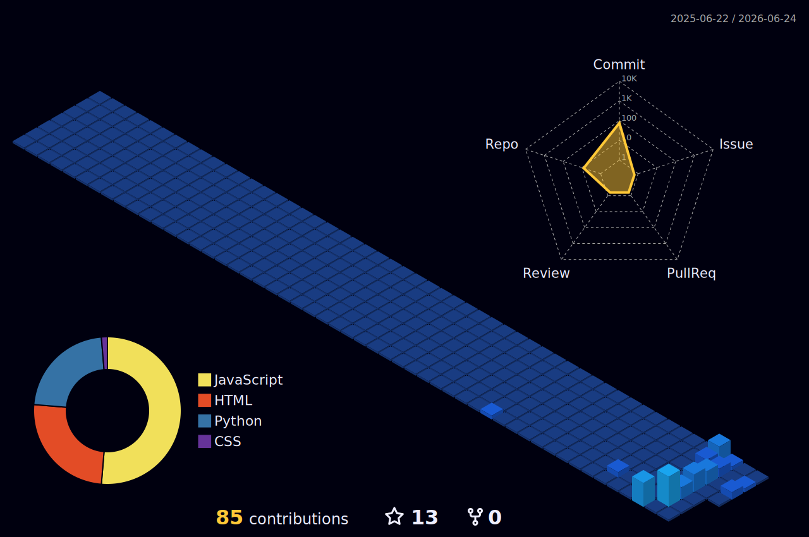

  
  <!-- Custom Animated Terminal Banner -->
  
  
   

  <!-- Badges & Visitor Counter -->
  

    
    
    
  

---

### 👋 About Me

I'm **Abhay**, a **Computer Science & AI Student** and passionate **Python Developer**. I love building web applications, designing interactive Discord bots, and diving deep into Data Structures and Algorithms (DSA). I'm always eager to learn new technologies and apply AI concepts to real-world projects.

- 🎓 Currently pursuing my degree in **Computer Science & Artificial Intelligence**.
- 🐍 Specializing in **Python Development** and backend engineering with **Flask**.
- 🤖 Experienced in building advanced **Discord Bots** with rich interactions.
- 💡 Passionate about solving complex coding challenges and mastering **DSA**.

---

### 🛠️ Tech Stack & Skills

  <table>
    <tr>
      <td align="center" width="150"><b>Languages</b></td>
      <td align="center" width="150"><b>Backend</b></td>
      <td align="center" width="150"><b>Frontend</b></td>
      <td align="center" width="150"><b>Other Tools</b></td>
    </tr>
    <tr>
      <!-- Languages -->
      <td align="top">
         
        
      </td>
      <!-- Backend -->
      <td align="top">
         
        
      </td>
      <!-- Frontend -->
      <td align="top">
         
        
      </td>
      <!-- Other Tools -->
      <td align="top">
         
        
      </td>
    </tr>
  </table>

---

### 📊 GitHub Statistics

  <table border="0">
    <tr>
      <td>
        
      </td>
      <td>
        
      </td>
    <tr>
      <td colspan="2" align="center">
        
      </td>
    </tr>
  </table>
  
   
  
  <!-- 3D Contribution Calendar -->
  

---

<!-- START_DAILY_QUOTE -->
> "The glass is neither half-full nor half-empty, the glass is twice as big as it needs to be."
>
> — *Programming Joke*
<!-- END_DAILY_QUOTE -->

---

### 🤝 Let's Connect

- 💼 Connect with me on [LinkedIn](https://www.linkedin.com/in/unbeatableabhay4206)
- 🚀 Check out my repositories and feel free to open issues or pull requests!
